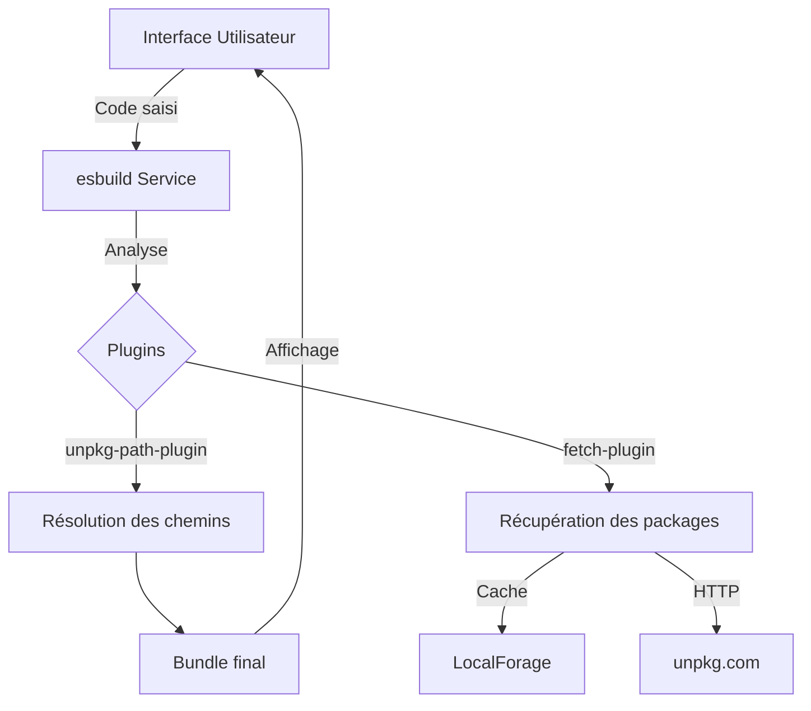

Application Overview
This application is an online code editor (similar to CodeSandbox or CodePen) that allows users to write and execute JavaScript/React code directly in their browser.

Key Features
1. User Interface:
A text area for writing code.
A button to execute the code.
An output area to display the result.
2. Core Functionality:
Uses esbuild-wasm for code compilation and bundling.
Caches packages locally using localForage.
Fetches packages dynamically from unpkg.com.

Key Components
esbuild Service

Found in index.tsx (lines 15-20).
This service is responsible for compiling and bundling the user's code efficiently.
fetch-plugin

Handles downloading and caching of NPM packages to reduce redundant network requests and improve performance.
unpkg-path-plugin

Resolves the paths of NPM packages to ensure they can be fetched and used correctly in the browser environment.
Workflow
Code Input:

The user writes JavaScript or React code in a textarea.
Code Compilation:

When the "Submit" button is clicked, the esbuild service compiles the code into a format that can run in the browser.
Dependency Resolution:

The plugins (fetch-plugin and unpkg-path-plugin) handle the resolution and retrieval of the necessary dependencies from unpkg.com and cache them using localForage for faster subsequent usage.
Execution and Output:

The compiled code is executed, and the result is displayed in a dedicated output area in the browser.
Purpose
This application serves as an online JavaScript development environment. It enables users to experiment with code and NPM packages directly in the browser, without needing a local setup. It's ideal for quick prototyping and learning.

